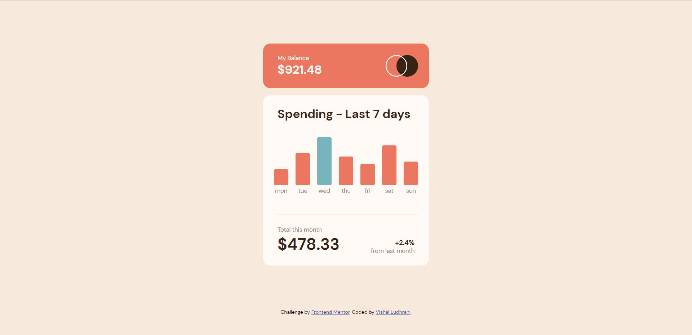
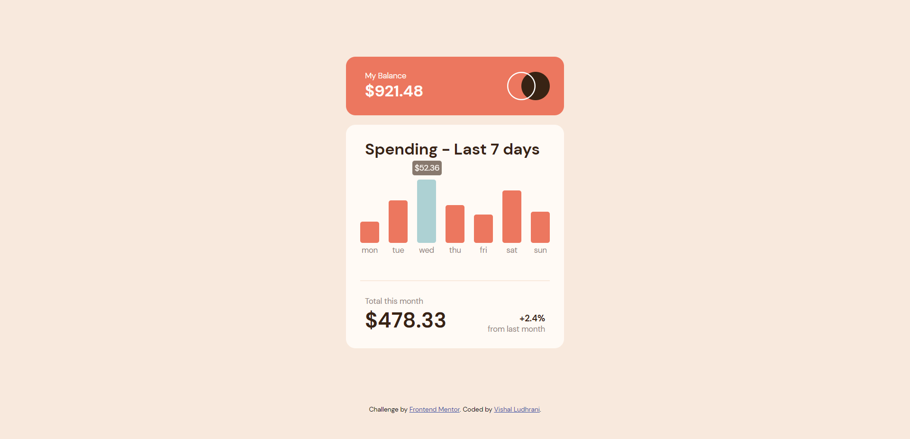

# Frontend Mentor - Expenses chart component solution

This is a solution to the [Expenses chart component challenge on Frontend Mentor](https://www.frontendmentor.io/challenges/expenses-chart-component-e7yJBUdjwt). Frontend Mentor challenges help you improve your coding skills by building realistic projects. 

## Table of contents

- [Frontend Mentor - Expenses chart component solution](#frontend-mentor---expenses-chart-component-solution)
  - [Table of contents](#table-of-contents)
  - [Overview](#overview)
    - [The challenge](#the-challenge)
    - [Screenshots](#screenshots)
      - [Stable state](#stable-state)
      - [Active state](#active-state)
  - [My process](#my-process)
    - [Built with](#built-with)
    - [What I learned](#what-i-learned)
    - [Continued development](#continued-development)
  - [Author](#author)

## Overview

### The challenge

Users should be able to:

- View the bar chart and hover over the individual bars to see the correct amounts for each day
- See the current day’s bar highlighted in a different colour to the other bars
- View the optimal layout for the content depending on their device’s screen size
- See hover states for all interactive elements on the page
- **Bonus**: Use the JSON data file provided to dynamically size the bars on the chart

### Screenshots
#### Stable state

#### Active state

## My process

### Built with

- Semantic HTML5 markup
- CSS custom properties
- Flexbox
- JavaScript

### What I learned

- How to use `::before` and `::after` pseudo classes
- How to import JSON content in JavaScript without using frameworks
- Revised a few media query topics (`screen` and `width`)
- Practiced CSS selector specificity

### Continued development

Things I will focus on more often hereafter:
- Practising `grid` and `flexbox` layouts
- Writing DRY code more often

**Note: Delete this note and the content within this section and replace with your own plans for continued development.**

## Author

- Website - [Vishal Ludhrani](https://vishalludhrani.github.io/vishalludhrani)
- Frontend Mentor - [@VishalLudhrani](https://www.frontendmentor.io/profile/VishalLudhrani)
- Twitter - [@vishalludhrani](https://www.twitter.com/vishalludhrani)
